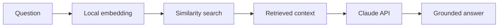
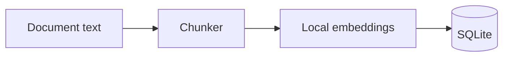
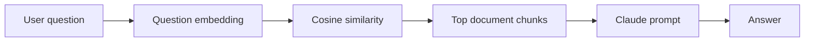

<div align="center">

**English** | [Português](README.pt-BR.md)

# RAG Demo with Claude API

**Full-stack document CRUD and retrieval-augmented generation pipeline.**

</div>

A portfolio project with separate backend and frontend applications. It implements document ingestion, chunking, local embeddings, vector similarity search and grounded answer generation through the Anthropic Claude API.

The backend uses Node.js, Express, TypeScript and SQLite. The frontend is a React, Vite and TypeScript SPA that communicates with the backend exclusively through REST.

## RAG pipeline



Instead of sending a question directly to the model, the application first retrieves relevant passages from registered documents. Claude is then instructed to answer from that context.

## Repository structure

```text
rag-demo-claude/
|-- backend/    # Express + TypeScript + SQLite REST API
`-- frontend/   # React + Vite + TypeScript SPA
```

Each directory has its own `package.json` and runs as an independent process.

## Backend endpoints

```text
POST   /api/documentos       Create a document and generate chunks/embeddings
GET    /api/documentos       List document summaries
GET    /api/documentos/:id   Retrieve complete document content and chunks
PUT    /api/documentos/:id   Update title and/or content
DELETE /api/documentos/:id   Delete one document
DELETE /api/documentos       Delete all documents

POST   /api/perguntas        Run retrieval and generate an answer with Claude
GET    /health               Public health check
```

### Document ingestion



### Question answering



## Security

| Protection | Location | Purpose |
| --- | --- | --- |
| Required `x-api-key` | `middlewares/apiKeyAuth.ts` | Protects knowledge-base administration with hashed, timing-safe comparison |
| Zod validation | `schemas/`, `middlewares/validate.ts` | Validates type, size and format before database or LLM access |
| Payload limits | Document schema and `express.json` | Reduces denial-of-service risk during chunking and embedding generation |
| Rate limiting | `middlewares/rateLimiters.ts` | Limits general traffic and expensive Claude requests |
| Restricted CORS | `server.ts` | Allows only the configured frontend origin |
| Security headers | `helmet()` | Adds baseline browser security headers and removes `X-Powered-By` |
| Parameterized SQL | `db/documentosRepository.ts` | Prevents SQL injection |
| Safe errors | `middlewares/errorHandler.ts` | Avoids exposing stack traces and internal errors |
| Validated environment | `config/env.ts` | Fails fast when required keys are missing |
| Session-only frontend key | `frontend/src/api/chaveApi.ts` | Keeps the shared key out of the compiled frontend bundle |
| React escaping | Frontend rendering | Renders document and answer content as text rather than raw HTML |

### Authentication limitation

The shared `API_KEY` model is appropriate for a portfolio project or a single knowledge-base owner. It is not a replacement for multiuser authentication. A production multiuser version should introduce individual accounts, password hashing, sessions or JWTs and role-based permissions.

## Requirements

- Node.js 22.5 or newer because the backend uses the native `node:sqlite` module
- An Anthropic API key from https://console.anthropic.com

## Run locally

Backend and frontend run as separate processes.

### Backend

```bash
cd backend
npm install
cp .env.example .env
```

Configure:

- `ANTHROPIC_API_KEY`: your Anthropic key
- `API_KEY`: a strong random key

Generate a key:

```bash
node -e "console.log(require('crypto').randomBytes(32).toString('hex'))"
```

Start the API:

```bash
npm run dev
```

The API runs at http://localhost:3001 and creates `backend/data/rag.db` automatically.

### Frontend

```bash
cd frontend
npm install
cp .env.example .env
npm run dev
```

The dashboard runs at http://localhost:5173. Enter the same key configured through `API_KEY` when prompted.

## Test the backend without the frontend

```bash
API_KEY="your-key-from-.env"

# Create a document
curl -X POST http://localhost:3001/api/documentos \
  -H "Content-Type: application/json" \
  -H "x-api-key: $API_KEY" \
  -d '{"titulo":"CuidaBem","conteudo":"CuidaBem is an elderly-care management system built with Node.js, Express and Prisma."}'

# List documents
curl http://localhost:3001/api/documentos \
  -H "x-api-key: $API_KEY"

# Ask a question
curl -X POST http://localhost:3001/api/perguntas \
  -H "Content-Type: application/json" \
  -H "x-api-key: $API_KEY" \
  -d '{"pergunta":"Which backend technologies are used by CuidaBem?"}'
```

## What this project demonstrates

| Capability | Implementation |
| --- | --- |
| LLM API integration | `backend/src/claude.ts` |
| RAG ingestion, chunking and retrieval | `backend/src/chunker.ts`, `backend/src/embeddings.ts`, `backend/src/services/ragService.ts` |
| Persistent document CRUD | `backend/src/db/`, `backend/src/routes/documentos.routes.ts` |
| Node.js REST API | `backend/src/server.ts` |
| Separate REST-consuming frontend | `frontend/src/api/client.ts` and `frontend/src/paginas/` |
| API security practices | Authentication, validation, rate limiting, CORS, safe errors and prepared statements |
| End-to-end TypeScript | Backend and frontend |

## Next steps

- Replace the shared key with real user authentication and JWT-based sessions
- Add PDF and DOCX upload support
- Stream Claude responses to the frontend
- Add multi-turn conversation history
- Add automated tests with Vitest and Testing Library
- Move from SQLite to pgvector, Pinecone or Weaviate when document volume requires it
